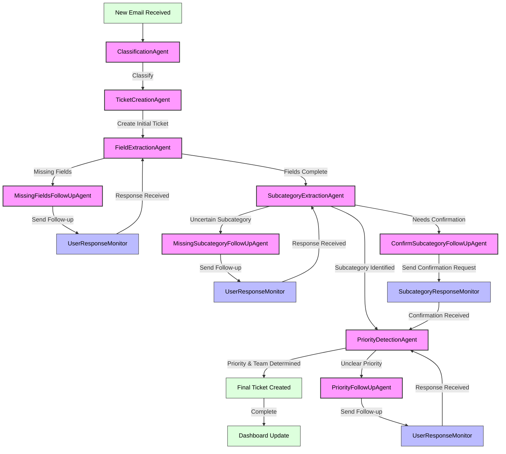

# HelpDesk Multi-Agent System

A sophisticated multi-agent system for automated email processing and helpdesk management, powered by AI.

## 🚀 Features

- **Smart Email Monitoring**
  - Real-time Gmail or Outlook inbox monitoring (configurable)
  - Configurable email filtering
  - Automated email processing pipeline
  - Intelligent tracking of email threads and responses

- **AI-Powered Classification**
  - Intelligent email categorization (Demande/Incident)
  - Natural Language Processing for content analysis
  - Confidence scoring and evidence extraction

- **Advanced Information Extraction Pipeline**
  - Field extraction from email content
  - Contextual subcategory extraction with rules
  - Priority detection based on content analysis
  - Progress tracking at each extraction stage

- **Enhanced Ticket Routing and Management**
  - Automatic team assignment via affectation teams
  - Sequential ticket numbering system (Elasticsearch-based)
  - Temporary ticket saving during processing stages
  - Thread-based ticket tracking and linking
  - Persistent storage in Elasticsearch with consistent organization

- **Comprehensive Follow-Up System**
  - Specialized follow-up agents for different missing information types
  - User response monitoring and state tracking
  - Smart thread management for ongoing conversations
  - Automatic state updates based on user responses

- **Email Communication**
  - Automated response generation
  - Personalized email templates
  - Secure Gmail and Outlook API integration
  - Professional formatting and structuring

- **Multi-Agent Architecture**
  - Task-specific agent specialization
  - Improved separation of concerns
  - Stateful workflow management
  - Process stage tracking with clear handoffs

- **Real-time Dashboard**
  - Interactive ticket visualization and filtering
  - Dynamic date range selection
  - Status-based categorization
  - Team assignment tracking and display
  - Multi-format ticket data compatibility
  - User-friendly interface for system monitoring

## 📋 Prerequisites

- Python 3.8+
- Gmail or Outlook API credentials
- Elasticsearch instance (local or remote)
- Required Python packages (see requirements.txt)

## 🛠 Installation

1. **Clone the repository**
   ```bash
   git clone https://github.com/yourusername/HelpDesk_Multi_Agent_System.git
   cd HelpDesk_Multi_Agent_System
   ```

2. **Install dependencies**
   ```bash
   pip install -r requirements.txt
   ```

3. **Configure credentials**
   - For Gmail: Place your Gmail API `credentials.json` in `config/credentials/`
   - For Outlook: Set your Microsoft Graph API credentials as environment variables (see below)
   - For both: Set up your `.env` file or environment variables as described below

## ⚙️ Configuration

Set the following environment variables in your `.env` file or system environment:

```env
# Email provider (choose 'gmail' or 'outlook')
INBOX_PROVIDER=gmail

# Elasticsearch configuration
ES_HOST=http://helpdesk_elasticsearch:9200
ES_USER=elastic
ES_PASS=changeme
ES_INDEX=tickets

# Gmail configuration (if using Gmail)
TOKEN_FILE=config/credentials/token.json
CREDENTIALS_FILE=config/credentials/credentials.json
GMAIL_SCOPES=https://www.googleapis.com/auth/gmail.modify,https://www.googleapis.com/auth/gmail.readonly,https://www.googleapis.com/auth/gmail.labels

# Outlook configuration (if using Outlook)
OUTLOOK_CLIENT_ID=your-client-id
OUTLOOK_CLIENT_SECRET=your-client-secret
OUTLOOK_TENANT_ID=your-tenant-id
```

You can also edit `config/settings.py` for additional system behavior customization.

## 🚀 Usage

1. **Start the system**
   ```bash
   python -m src.main
   ```

   - The system will start monitoring the configured inbox and launch the dashboard automatically.
   - Access the dashboard at [http://localhost:8501](http://localhost:8501).

2. **System Workflow**
   - Authenticates with Gmail or Outlook using OAuth 2.0 or Microsoft Graph API
   - Monitors specified inbox for new emails
   - Classifies emails as Incidents or Demandes
   - Processes through multi-stage extraction pipeline:
     - Field extraction (user details, request info)
     - Subcategory extraction with rules-based validation
     - Priority detection with contextual analysis and team assignment
   - Creates tickets with appropriate status tracking
   - Sends follow-up emails for missing information
   - Monitors for user responses and updates ticket accordingly
   - Logs all activities and results

### System Process Flow



## 🔧 Agent Architecture

The system uses specialized agents, each handling a specific aspect of the workflow:

- **ClassificationAgent**: Determines whether an email is an incident or a service request
- **TicketCreationAgent**: Creates initial ticket structure from email content
- **FieldExtractionAgent**: Extracts essential information fields from email content
- **SubcategoryExtractionAgent**: Identifies appropriate subcategory for the ticket
- **PriorityDetectionAgent**: Analyzes content to determine appropriate priority level and assigns tickets to the correct team
- **ResponseMonitors**: Track user replies to follow-up emails
  - **UserResponseMonitor**: Processes general user responses
  - **SubcategoryResponseMonitor**: Handles subcategory confirmation responses
  - **PriorityResponseMonitor**: Handles priority clarification responses
- **Follow-Up Agents**: Generate specialized follow-up emails for missing information
  - **MissingFieldsFollowUpAgent**: Follows up on incomplete basic information
  - **MissingSubcategoryFollowUpAgent**: Requests clarification on ticket category
  - **PriorityFollowUpAgent**: Seeks clarification on urgency when unclear
  - **ConfirmSubcategoryFollowUpAgent**: Confirms subcategory selection with user
- **DemandeAgent**: Handles service requests (demandes)

## 📊 System Architecture

```
HelpDesk_Multi_Agent_System/
├── config/
│   ├── credentials/
│   └── settings.py
├── dashboard_data/
│   └── (Dashboard data files)
├── src/
│   ├── agents/
│   │   ├── classification_agent.py
│   │   ├── confirm_subcategory_follow_up_agent.py
│   │   ├── demande_agent.py
│   │   ├── field_extraction_agent.py
│   │   ├── missing_fields_follow_up_agent.py
│   │   ├── missing_subcategory_follow_up_agent.py
│   │   ├── priority_detection_agent.py
│   │   ├── priority_follow_up_agent.py
│   │   ├── subcategory_extraction_agent.py
│   │   ├── subcategory_response_monitor.py
│   │   ├── ticket_creation_agent.py
│   │   ├── user_response_monitor.py
│   │   └── priority_response_monitor.py
│   ├── core/
│   │   ├── config/
│   │   ├── gmail_service.py
│   │   ├── gmail_sender.py
│   │   ├── outlook_service.py
│   │   ├── outlook_sender.py
│   │   ├── llm_handler.py
│   │   ├── subcategory_rules.py
│   │   ├── ticket_management.py
│   │   ├── workflow.py
│   │   └── elasticsearch_service.py
│   ├── dashboard/
│   │   └── app.py
│   ├── monitoring/
│   │   ├── gmail_monitor.py
│   │   └── outlook_monitor.py
│   ├── utils/
│   │   ├── email_utils.py
│   │   ├── logger.py
│   │   └── prompts.py
│   └── main.py
├── requirements.txt
└── README.md
```

## 🎯 Ticket Handling

### Ticket Creation Workflow
- All tickets (temporary and final) are stored and managed in Elasticsearch.
- Temporary tickets use the format `TEMP-STAGE-YYYYMMDD-XXXX`.
- Final tickets use the format `TKT-YYYYMMDD-XXXX`.
- Ticket IDs are generated and managed by the system in Elasticsearch.
- No file-based ticket storage or counter is used.

### Priority and Affectation Rules
- Enhanced rule structure with P1 (CRITIQUE) and P2 (ELEVEE) levels
- Each rule includes description, priority level, and affectation team
- Rules organized by subcategory for precise matching
- Tickets automatically routed to appropriate teams based on content analysis

### Follow-up Process
1. Missing information detected during any extraction stage
2. Appropriate follow-up agent generates specific email
3. Response monitor tracks user replies
4. Ticket updated with new information from responses
5. Processing continues from appropriate stage

## 📊 Dashboard

- The dashboard provides a real-time view of the ticket system, reading directly from Elasticsearch.
- Interactive filtering by date range, status, and category
- Visual representation of ticket distribution
- Team assignment tracking for workload monitoring
- Quick search and filtering capabilities
- Detailed ticket information view with affectation team display
- Status tracking and progress visualization

Access the dashboard at `http://localhost:8501` after starting the system.

## 🔍 Monitoring and Logging

- Comprehensive logging system with debug levels
- Real-time activity monitoring
- Detailed error tracking and debugging
- Email sending transaction logs
- Performance metrics collection
- Atomic operations for data integrity
- Thread tracking for complete conversation history

## 📦 Requirements

See `requirements.txt` for the full list. Key dependencies include:
- streamlit
- pandas
- python-dotenv
- google-auth-oauthlib
- google-auth-httplib2
- google-api-python-client
- openai
- beautifulsoup4
- python-dateutil
- langchain, langgraph
- PyPDF2, python-docx, python-pptx
- chromadb
- graphviz
- watchfiles
- ipython
- elasticsearch
- msal
- msgraph-core

## 🌍 Environment Variables Reference

| Variable                | Purpose                                      |
|------------------------|----------------------------------------------|
| INBOX_PROVIDER         | 'gmail' or 'outlook'                         |
| ES_HOST                | Elasticsearch host URL                       |
| ES_USER                | Elasticsearch username                       |
| ES_PASS                | Elasticsearch password                       |
| ES_INDEX               | Elasticsearch index name (default: tickets)  |
| TOKEN_FILE             | Path to Gmail token.json                     |
| CREDENTIALS_FILE       | Path to Gmail credentials.json                |
| GMAIL_SCOPES           | Gmail API scopes (comma-separated)           |
| OUTLOOK_CLIENT_ID      | Outlook (Azure) client ID                    |
| OUTLOOK_CLIENT_SECRET  | Outlook (Azure) client secret                |
| OUTLOOK_TENANT_ID      | Outlook (Azure) tenant ID                    |

## 🤝 Contributing

1. Fork the repository
2. Create your feature branch (`git checkout -b feature/amazing-feature`)
3. Commit your changes (`git commit -m 'Add amazing feature'`)
4. Push to the branch (`git push origin feature/amazing-feature`)
5. Open a Pull Request
